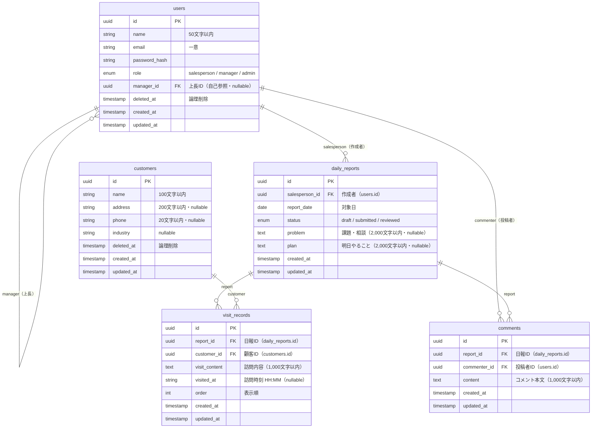

# 営業日報システム ER図

---

## エンティティ関連図

---

## テーブル定義

### users（営業担当者）

| カラム名 | 型 | NULL | 制約 | 説明 |
|----------|----|------|------|------|
| id | UUID | NOT NULL | PK | 主キー |
| name | VARCHAR(50) | NOT NULL | | 氏名 |
| email | VARCHAR(255) | NOT NULL | UNIQUE | メールアドレス |
| password_hash | VARCHAR(255) | NOT NULL | | ハッシュ化パスワード |
| role | ENUM | NOT NULL | | `salesperson` / `manager` / `admin` |
| manager_id | UUID | NULL | FK → users.id | 上長ID（自己参照） |
| deleted_at | TIMESTAMP | NULL | | 論理削除日時 |
| created_at | TIMESTAMP | NOT NULL | | 作成日時 |
| updated_at | TIMESTAMP | NOT NULL | | 更新日時 |

### customers（顧客マスタ）

| カラム名 | 型 | NULL | 制約 | 説明 |
|----------|----|------|------|------|
| id | UUID | NOT NULL | PK | 主キー |
| name | VARCHAR(100) | NOT NULL | | 顧客名 |
| address | VARCHAR(200) | NULL | | 住所 |
| phone | VARCHAR(20) | NULL | | 電話番号（数字・ハイフンのみ） |
| industry | VARCHAR(100) | NULL | | 業種 |
| deleted_at | TIMESTAMP | NULL | | 論理削除日時 |
| created_at | TIMESTAMP | NOT NULL | | 作成日時 |
| updated_at | TIMESTAMP | NOT NULL | | 更新日時 |

### daily_reports（日報）

| カラム名 | 型 | NULL | 制約 | 説明 |
|----------|----|------|------|------|
| id | UUID | NOT NULL | PK | 主キー |
| salesperson_id | UUID | NOT NULL | FK → users.id | 作成者ID |
| report_date | DATE | NOT NULL | UNIQUE(salesperson_id, report_date) | 対象日 |
| status | ENUM | NOT NULL | | `draft` / `submitted` / `reviewed` |
| problem | TEXT | NULL | | 課題・相談（2,000文字以内） |
| plan | TEXT | NULL | | 明日やること（2,000文字以内） |
| created_at | TIMESTAMP | NOT NULL | | 作成日時 |
| updated_at | TIMESTAMP | NOT NULL | | 更新日時 |

> **制約**: `(salesperson_id, report_date)` の組み合わせは一意（同一営業・同日に日報は1件のみ）

### visit_records（訪問記録）

| カラム名 | 型 | NULL | 制約 | 説明 |
|----------|----|------|------|------|
| id | UUID | NOT NULL | PK | 主キー |
| report_id | UUID | NOT NULL | FK → daily_reports.id | 日報ID |
| customer_id | UUID | NOT NULL | FK → customers.id | 顧客ID |
| visit_content | TEXT | NOT NULL | | 訪問内容（1,000文字以内） |
| visited_at | VARCHAR(5) | NULL | | 訪問時刻（HH:MM形式） |
| order | INT | NOT NULL | | 表示順 |
| created_at | TIMESTAMP | NOT NULL | | 作成日時 |
| updated_at | TIMESTAMP | NOT NULL | | 更新日時 |

### comments（コメント）

| カラム名 | 型 | NULL | 制約 | 説明 |
|----------|----|------|------|------|
| id | UUID | NOT NULL | PK | 主キー |
| report_id | UUID | NOT NULL | FK → daily_reports.id | 日報ID |
| commenter_id | UUID | NOT NULL | FK → users.id | 投稿者ID |
| content | TEXT | NOT NULL | | コメント本文（1,000文字以内） |
| created_at | TIMESTAMP | NOT NULL | | 作成日時 |
| updated_at | TIMESTAMP | NOT NULL | | 更新日時 |

---

## リレーション一覧

| 親テーブル | 子テーブル | カラム | 説明 |
|-----------|-----------|--------|------|
| users | users | manager_id → id | 上長（自己参照・任意） |
| users | daily_reports | salesperson_id → id | 日報の作成者 |
| users | comments | commenter_id → id | コメントの投稿者 |
| daily_reports | visit_records | report_id → id | 日報に紐づく訪問記録 |
| daily_reports | comments | report_id → id | 日報に紐づくコメント |
| customers | visit_records | customer_id → id | 訪問記録の対象顧客 |

---

## 業務ルールと制約

| ルール | 実装箇所 |
|--------|---------|
| 同一営業・同一日付の日報は1件のみ | `daily_reports(salesperson_id, report_date)` にUNIQUE制約 |
| 訪問記録に紐づく顧客は削除不可 | アプリケーション層でチェック（BIZ-008） |
| 日報・コメントが存在する担当者は削除不可 | アプリケーション層でチェック（BIZ-009） |
| 顧客・担当者は論理削除（deleted_at） | `deleted_at IS NULL` でフィルタリング |
| 提出済・確認済の日報は編集不可 | アプリケーション層でステータスチェック |

---

*以上*
